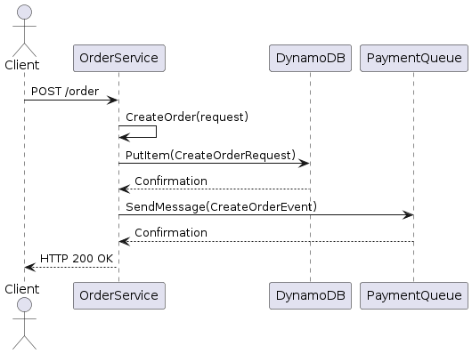
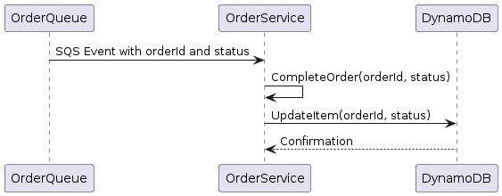
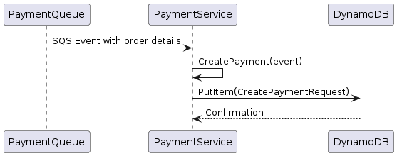
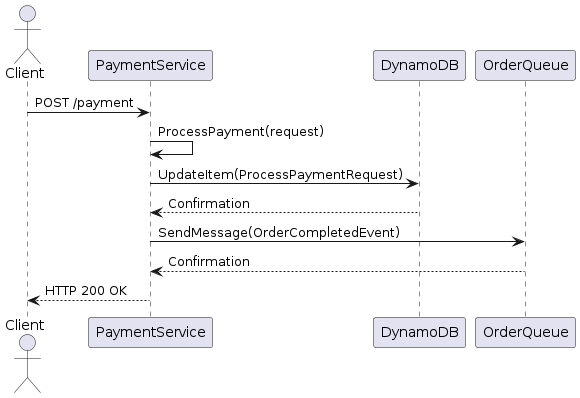

# Challenge

This is a challenge to create a simple communication between services using ApiGateway, SQS and DynamoDB.

## Architecture

The architecture is composed by 2 services:

- Order Service
- Payment Service

Package structure:

```bash
└── go-aws-lambda
    ├── docs # Diagrams
    ├── order # Order Service
    ├──├── handler
    ├──├──├── order.go
    ├──├── model
    ├──├──├── model.go
    ├──├── service
    ├──├──├── order.go
    ├──├──├── payment.go
    ├──├── go.mod
    ├──├── main.go
    ├── payment # Payment Service
    ├──├── handler
    ├──├──├── payment.go
    ├──├── model
    ├──├──├── model.go
    ├──├── service
    ├──├──├── order.go
    ├──├──├── payment.go
    ├──├── go.mod
    ├──├── main.go
    ├── README.md
    ├── template.yaml # SAM template
```

## Diagrams

### Order Service

Create Order



Complete Order:



### Order Payment

Create Payment



Process payment


